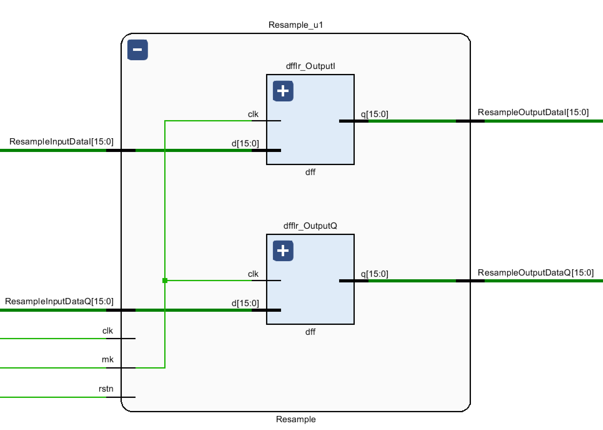

# Coherent demodulation of M-PSK in FPGA
概述

将M-PSK信号的符号同步部署到了FPGA上，目前只做了前仿真，过段时间有空了再做后仿真。我也在准备把载波同步部署上去，已经在`Matlab`上做了算法的原型验证，但是涉及到三角函数和开方，部署的化还没那么快。  
- 数据类型：所有数据采用16bit有符号定点数表示，其中最高位为符号位，次高位为整数位，剩下14个bit表示小数部分。
- 开发环境：Windows11，Vivado 2017.4
- 仿真环境：Vivado内置仿真器
- 最后修改时间：2022.04.21

---

## 文件结构
`src->SymbolSync`：符号同步的代码。  
`src->DFF`：  各种标准DFF，copy自我的另一个 [项目](https://github.com/WeChatTeam/StandardDFF.git)。  
`src->carrierSync`：载波同步的代码，目前还不完善。  
`data`：未解调的M-PSK信号，以及一个浮点数转定点数的`Matlab`脚本。  
`sim->src`：符号同步的激励文件，以及每个模块单独的测试激励文件。
`sim->config`：Xsim仿真环境的配置参数。

---

## 符号同步
以QPSK为例，该项目采用加纳算法来实现符号同步，一共包含5个步骤：`内插滤波器`，`误差检测器`，`环路滤波器`，`脉冲控制器`，`重采样模块`。实际上BPSK，8PSK，DQPSK，DQPSK同样适用于该算法。  
- `data_X_IN`为待解调信号
- `mk`为重采样时钟
- `data_X_OUT`为解调后的基带信号  

  
### 内插滤波器
文件位置：`src->SymbolSync->InterpolatedFilter.v`  
  
其中coffCulate用于计算滤波器系数，是个比较复杂的组合逻辑，还有优化空间，暂时没时间。
```C
coff1 = (1.0 / 6) *pow(uk, 3) - (1.0 / 6)*uk[n];
coff2 = (-1.0 / 2)*pow(uk, 3) + (1.0 / 2)*pow(uk, 2) + uk;
coff3 = (1.0 / 2) *pow(uk, 3) - pow(uk, 2) - (1.0 / 2)*uk + 1;
coff4 = (-1.0 / 6)*pow(uk, 3) + (1.0 / 2)*pow(uk, 2) - (1.0 / 3)*uk;
coffOutputDataFixedI = coff1*BufferI1 + coff2*BufferI2 + coff3*BufferI3 + coff4*BufferI4;
coffOutputDataFixedQ = coff1*BufferQ1 + coff2*BufferQ2 + coff3*BufferQ3 + coff4*BufferQ4;
```
### 误差检测器
文件位置：`src->SymbolSync->ErrDetecer.v`  
  
组合逻辑部分公式如下
```C
ErrDetecerOutputDataQ = (BufferQ1-BufferQ5)*BufferQ3;
ErrDetecerOutputDataI = (BufferI1-BufferI5)*BufferI3;
ErrDetecerOutputData = ErrDetecerOutputDataI + ErrDetecerOutputDataQ;
```
### 环路滤波器
文件位置：`src->SymbolSync->LoopFilter.v` 
  
组合逻辑部分公式如下
```C
double C1 = 8.0 / 3 * 0.01;
double C2 = 32.0 / 9 * 0.01^2;
if (mk == true) {
    Buffer1 = C2 * inputData + Buffer2;
    LoopFilterOutputData = Buffer1 + C1 * inputData;
}
```
### 脉冲控制器
文件位置：`src->SymbolSync->TimingControl.v` 
  
```c
// samplingFrequency是信号采样频率
// symbolRate是码元速率
TimingControlModData = Buffer2 - floor(Buffer1);
Buffer1 = TimingControlModData - TimingControlInputData - (1.0 / (samplingFrequency / symbolRate));
if (Buffer2 < TimingControlModData)
    mk = true;
else {
    mk = false;
}
if (mk == true) {
    uk = TimingControlModData;
}		
```
### 重采样模块
文件位置：`src->SymbolSync->Resample.v` 
  